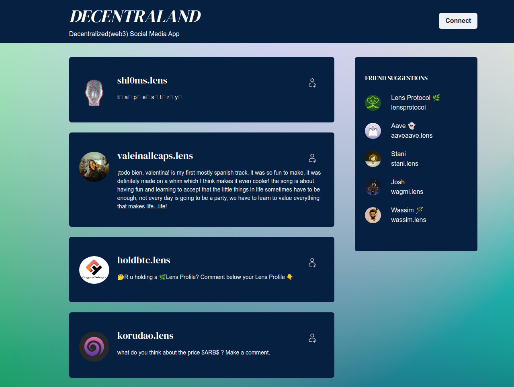

# Decentralized Social Media Application

# live demo: [link](https://d-social-usupal.vercel.app/)
## need to install [metamask chrome extention](https://chrome.google.com/webstore/detail/metamask/nkbihfbeogaeaoehlefnkodbefgpgknn?hl=en) to connect with ethereum wallet.  

# D-Social: A Decentralized Web3 Social Media Application

Welcome to D-Social, a cutting-edge decentralized social media application that aims to create a secure and censorship-resistant social network. Built using ReactJS and utilizing the Lens API, D-Social offers microblogging features that enable users to share content and interact with one another in a completely decentralized environment. 

## Table of Contents
- [Installation](#installation)
- [Usage](#usage)
- [Contributing](#contributing)
- [License](#license)

## Installation

To use D-Social locally on your machine, follow these steps:

1. Clone or download this repository to your local machine.
2. Open your terminal and navigate to the project directory.
3. Run `npm install` to install all the required dependencies.
4. Create a `.env.local` file in the root of the project directory with the following content:
   
   ```REACT_APP_LENS_API_KEY=<your-lens-api-key>```

   Replace `<your-lens-api-key>` with your own Lens API key. If you don't have one yet, you can get one by signing up at [Lens Protocol](https://lens.org/).
5. Run `npm start` to start the development server.

## Usage

To use D-Social, follow these steps:

1. Open your web browser and go to http://localhost:3000/.
2. Sign in with [metamask wallet](https://chrome.google.com/webstore/detail/metamask/nkbihfbeogaeaoehlefnkodbefgpgknn?hl=en) that works with web3 (such as MetaMask).
3. Start using D-Social by creating a profile, sharing content, and interacting with other users in a decentralized environment.

## Contributing

Contributions are welcome! If you'd like to contribute to this project, please follow these steps:

1. Fork this repository.
2. Create a new branch (`git checkout -b feature/<feature-name>`) and make your desired changes.
3. Commit your changes (`git commit -m "Add feature X"`).
4. Push to the branch (`git push origin feature/<feature-name>`).
5. Open a pull request and describe your changes.

## License

This project is licensed under the [MIT License](https://choosealicense.com/licenses/mit/).
